# 🚀 AWS Lake Formation Workshop

This repository documents my hands-on build of a **secure data lake** using AWS Lake Formation, Glue, Athena, and EMR.  
It includes setup, fine-grained access control, ETL jobs, and queries run via Athena.

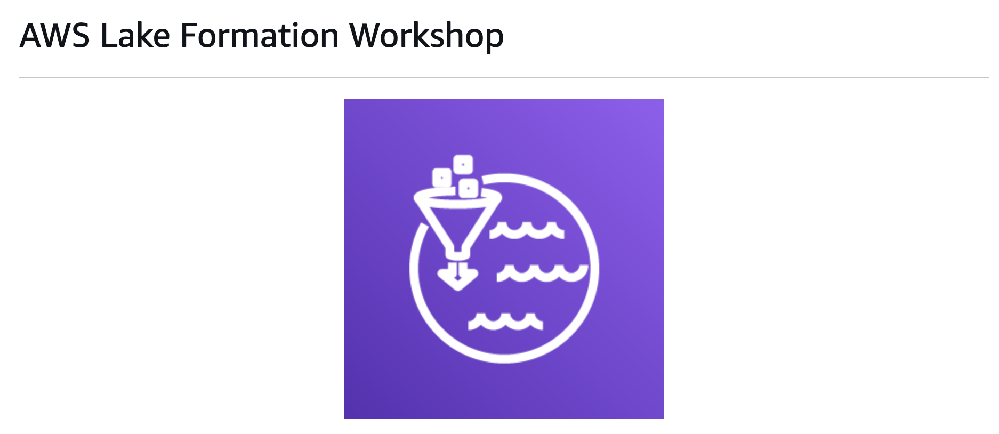

---

## 📂 Repo Structure
```
├── architecture/        # Diagrams (if any)
├── screenshots/         # AWS Console screenshots
├── LICENSE
└── README.md
```

---

## 📝 What I did (step-by-step)

### 1) CloudFormation Setup
- Launched 2 stacks (`Lake-Formation-Workshop`, `Lake-Formation-With-EMR-RuntimeRole-Workshop`).
- Automatically created IAM users, roles, and S3 buckets.  

📸 Screens:  
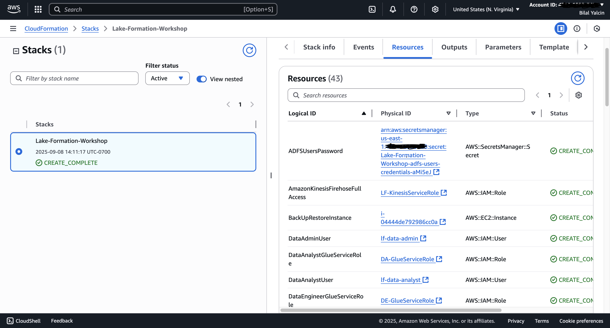  
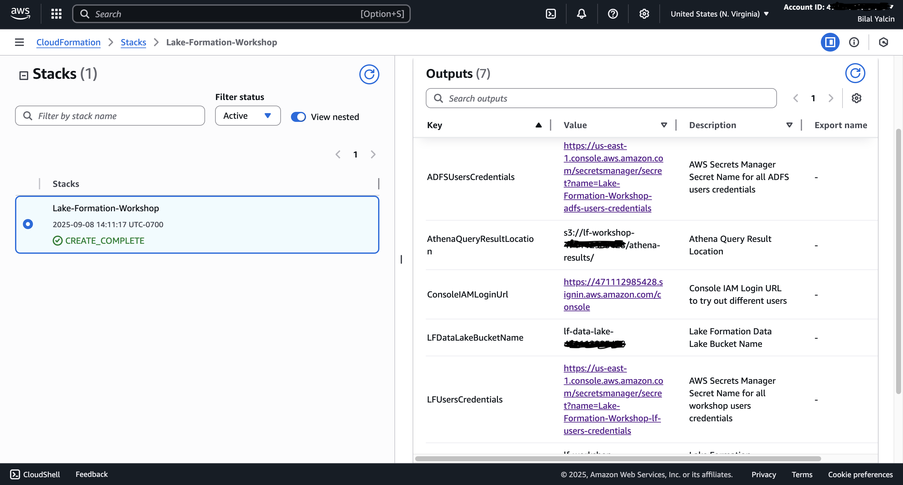  
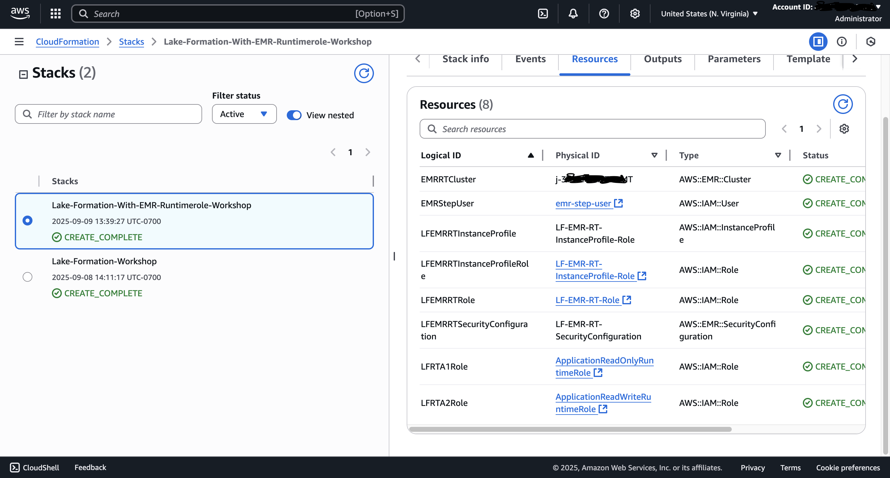  
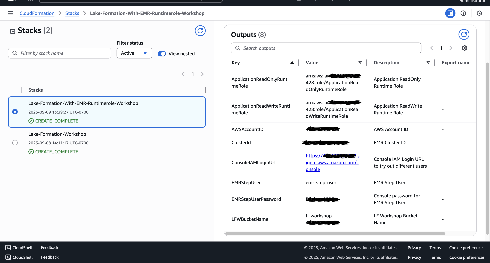  

---

### 2) Lake Formation Setup
- Created `tpc` database.  
- Registered tables from Glue Data Catalog.  
- Defined LF-Tags and applied to sensitive columns.  

📸 Screens:  
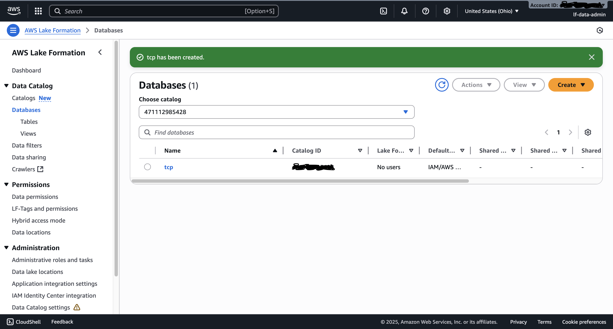  
  
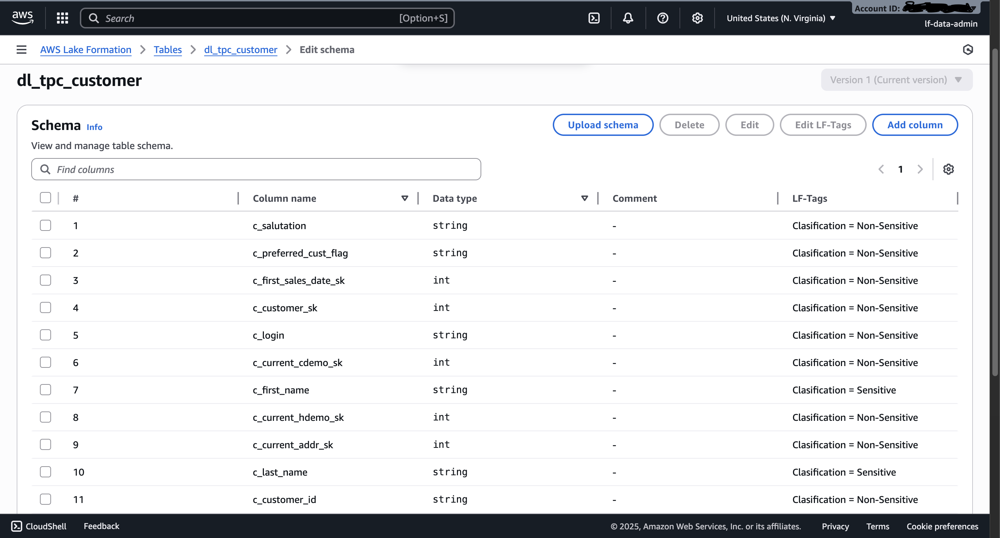  
  

---

### 3) Fine-Grained Access
- Created data filters (row-level, column-level).  

📸 Screens:  
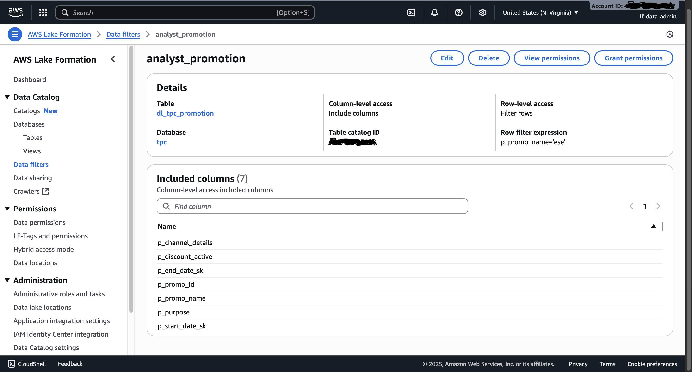  
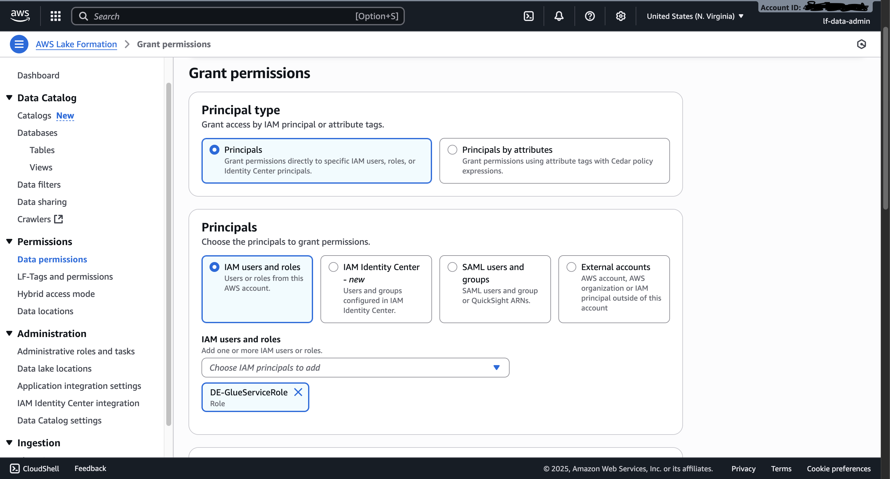  

---

### 4) EMR & Runtime Roles
- Launched EMR cluster with runtime roles.  
- Submitted steps to test permissions (read/write/select).  

📸 Screens:  
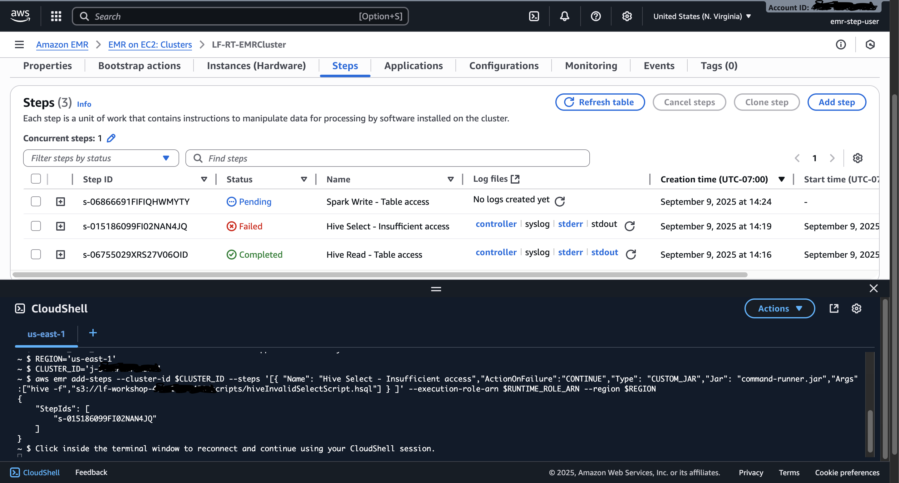  

---

### 5) Glue ETL Job
- Built Glue Studio ETL pipeline (S3 → SQL Transform → S3).  

📸 Screens:  
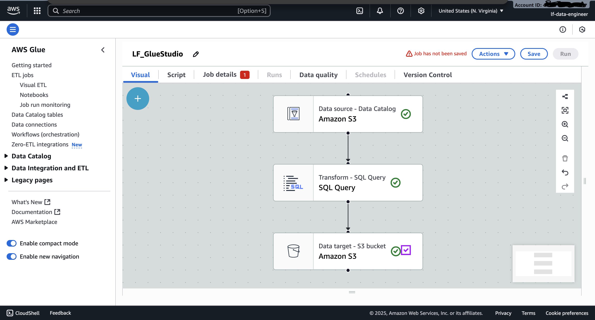  

---

### 6) Athena Queries
- Queried `dl_tpc_item` and `dl_tpc_web_page` tables.  

📸 Screens:  
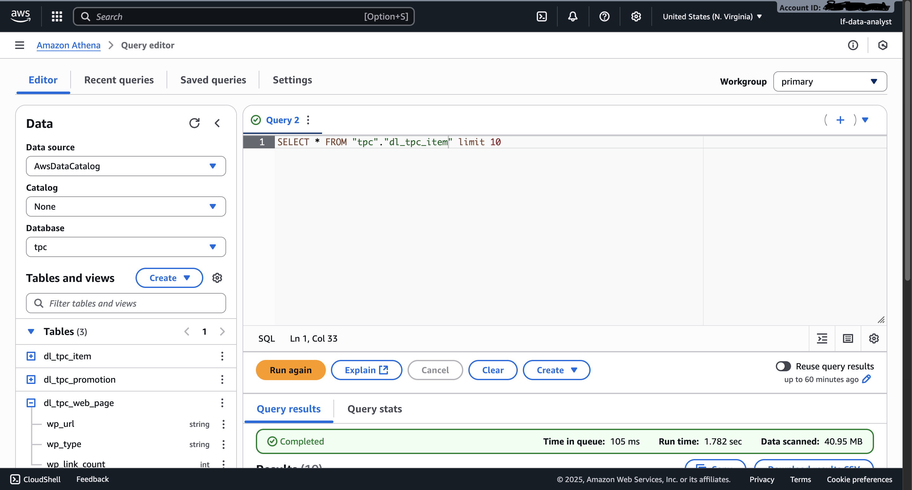  
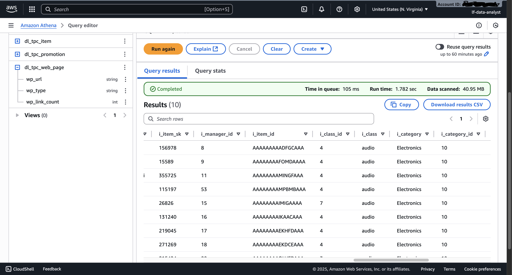  
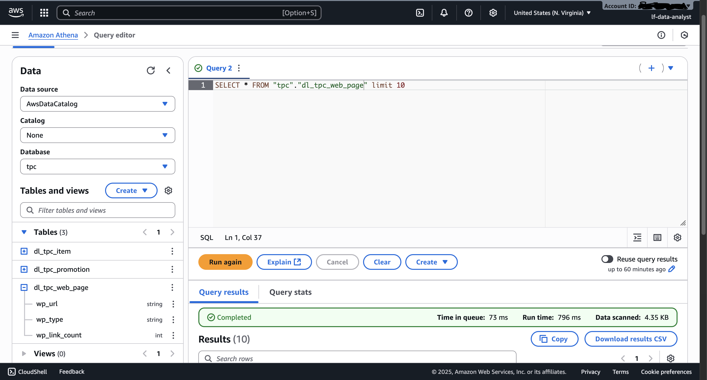  
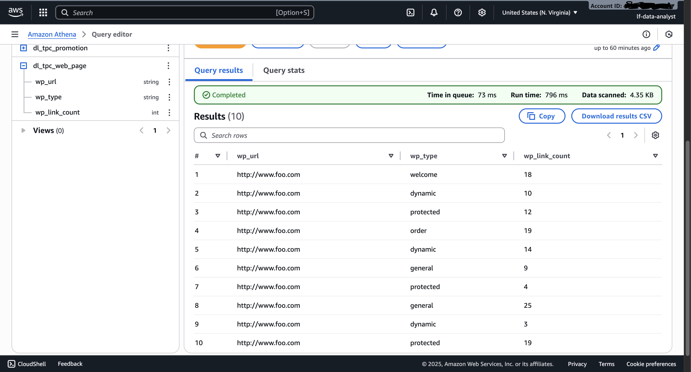  
